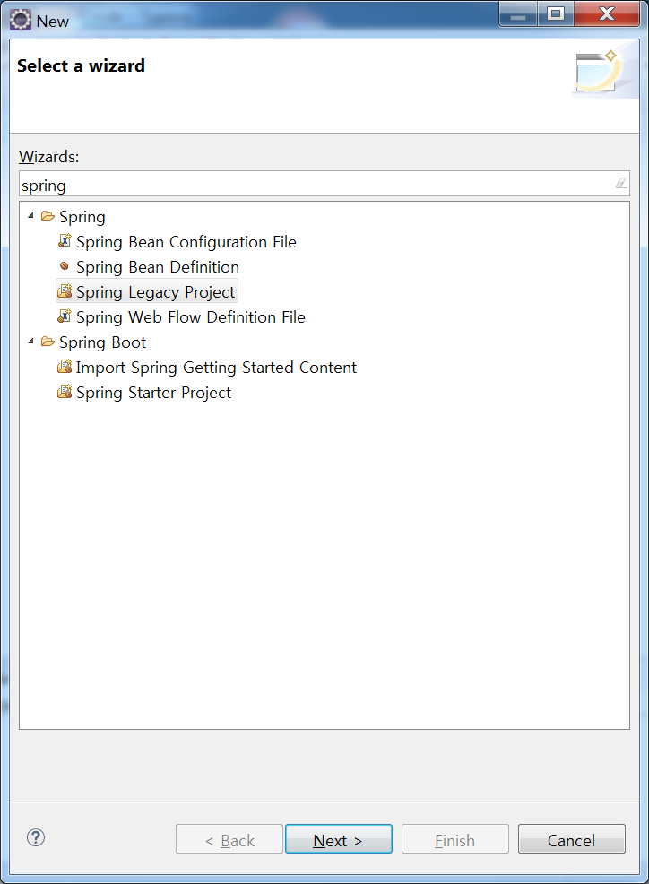
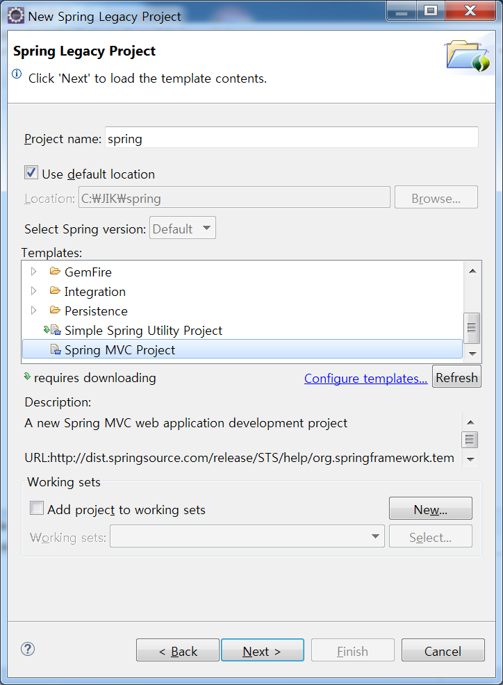
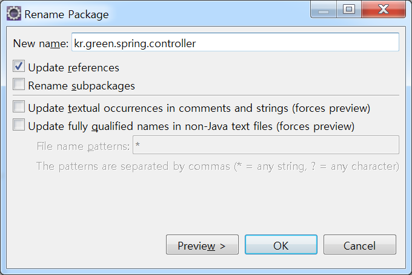
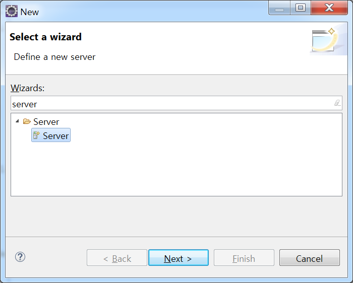
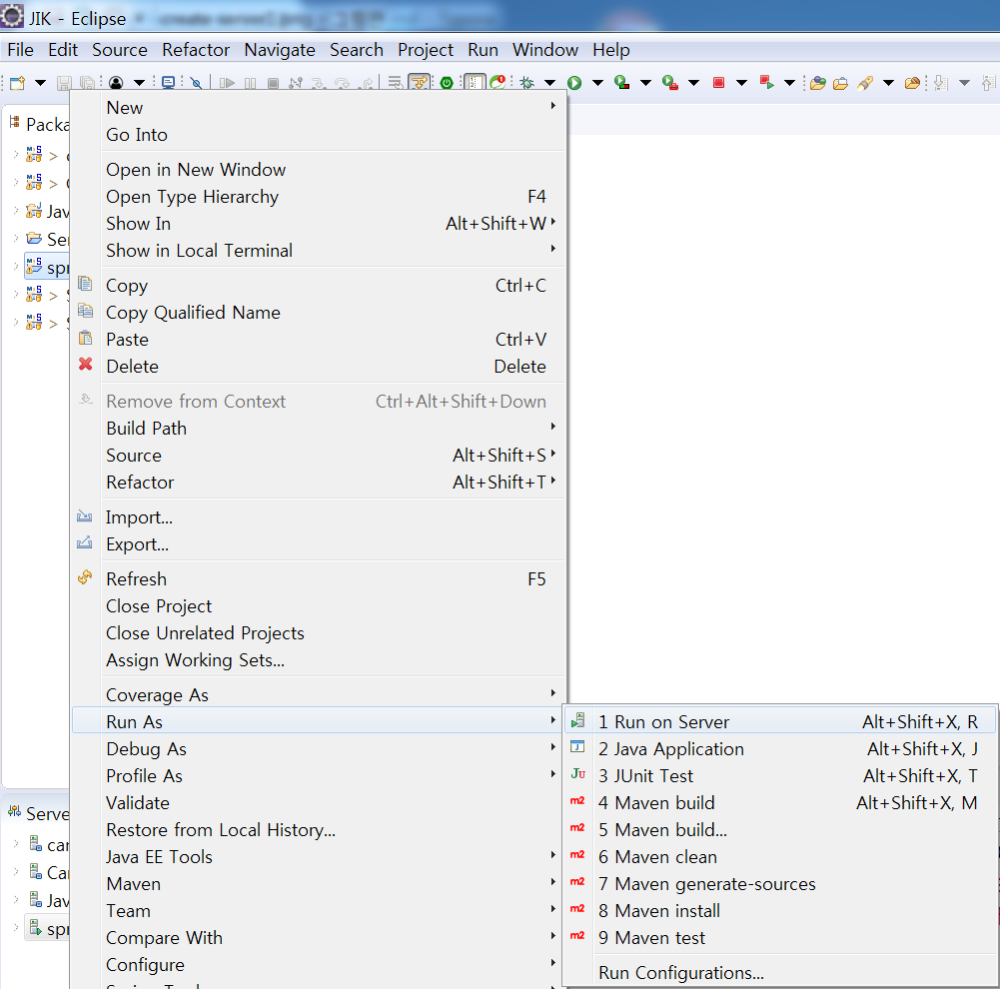
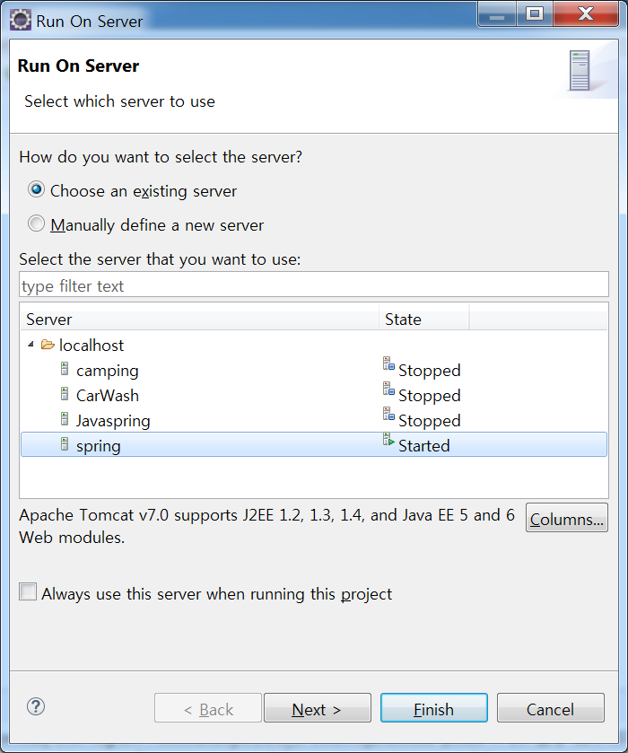
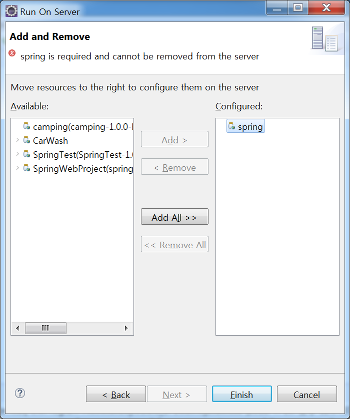
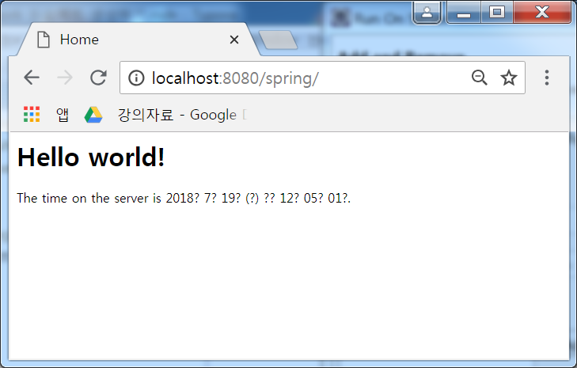
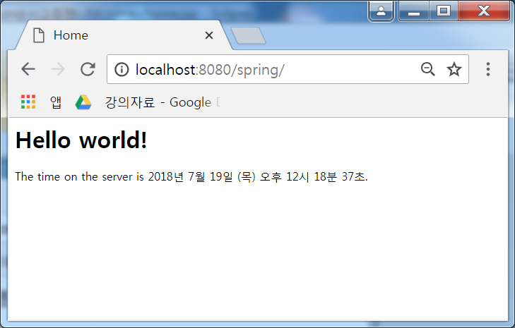

#  Spring Project 만들기

## 1. Spring Legacy Project 생성하기 

* File > new > other클릭

* Spring Legacy Project 검색 후 선택 

  

* Project name 입력 > Templates에서 Spring MVC Project 체크 후 Next

  

* 프로젝트 패키지 이름 입력 후 Finish 클릭
  * com.mycompany.myapp
  * 예시 : kr.green.spring

* 프로젝트 생성 후 패키지 클릭하여 F2 또는 우클릭 > refactor > rename 클릭하여 기존 패키지 이름에 .controller 추가한다.
  * 예시 :  kr.green.spring.controller

  

## 2. Server 생성하기

* File > new > other 클릭

* Server 선택

  

* 설치한 Tomcat 버전에 맞게 Tomcat 선택(예 : Tomcat v8.0 Server)
* Server runtime environment에 Add 클릭
* Tomcat installation directory에 Browse... 버튼 클릭
* 설치된 톰캣 폴더 선택 후 Finish 클릭(일반적으로 C:/Program Files/Apache Software Foundation 폴더에 버전별로 있으므로 선택한 버전과 맞는 폴더 선택)
  * 예 : C:\Program Files\Apache Software Foundation\Tomcat 8.0
* 선택사항 : Server name에 원하는 이름을 입력하면 됨
* Finish 클릭하여 Server 생성 완료

## 3. 테스트 하기

* 프로젝트 이름 우클릭 > Run as > Run on Server 클릭

  

* 생성한 서버 클릭 후 Next 클릭

  

* 1에서 생성한 프로젝트를 Add해 주고 Finish 클릭

  

* 서버가 실행되면 웹 브라우저에 URI (localhost:8080/프로젝트이름 입력)를 입력

  

* Hello world! 및 서버 시간 확인

## 4. home.jsp 인코딩 변경(UTF-8로)

* home.jsp 경로
  * src > main > webapp > WEB-INF > views
* 수정 전 코드

```jsp
<%@ taglib uri="http://java.sun.com/jsp/jstl/core" prefix="c" %>
<%@ page session="false" %>
<html>
<head>
    <title>Home</title>
</head>
<body>
<h1>
	Hello world!  
</h1>

<P>  The time on the server is ${serverTime}. </P>
</body>
</html>
```

* 수정 후 코드

```jsp
<%@ page language="java" contentType="text/html; charset=UTF-8"
    pageEncoding="UTF-8"%>
<%@ taglib uri="http://java.sun.com/jsp/jstl/core" prefix="c" %>
<html>
<head>
	<title>Home</title>
</head>
<body>
<h1>
	Hello world!  
</h1>

<P>  The time on the server is ${serverTime}. </P>
</body>
</html>

```

* 결과

  

