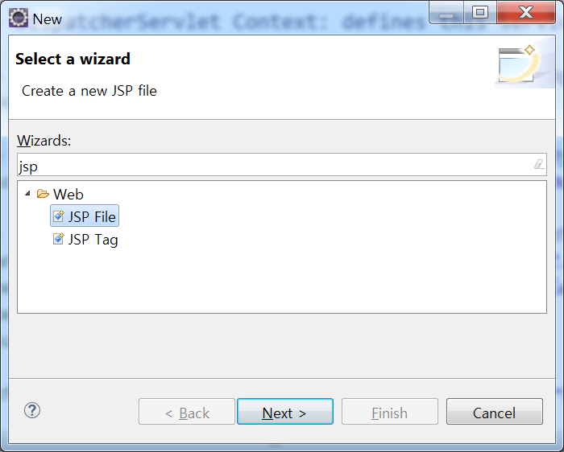

# 새로운 페이지 추가하기

* 새로운 페이지를 추가하려면 다음 두 작업을 해야 함
  1. 컨트롤러에 메소드 추가 및 jsp와 연결
  2. jsp 파일 추가
* localhost:8080/spring/test가 호출 되었을 때 test.jsp가 연결되도록 다음과 같이 하면 됨

## 1. HomeController에 test메소드 추가

* test메소드는 localhost:8080/spring/test가 입력될 때 호출된다.
* 호출 되어 반환하는 test는 jsp 파일로 이와 관련 되 정보는 servlet-context.xml 파일에서 확인할 수 있다.
* 즉 localhost:8080/spring/test가 브라우저에 입력되면 homeController의 test메소드가 호출 되고 test.jsp를 브라우저에 출력한다.

```java
@RequestMapping(value = "/test")
public String test() {
    return "test";
}
```

## 2. test.jsp 파일 생성

* jsp 파일은 src > main > webapp > WEB-INF > views폴더 안에 생성한다.
* views 폴더 우클릭 > new > other 클릭
* JSP File 선택 후 파일명 입력 후 완료



## 테스트하기

* 서버 실행 후 localhost:8080/spring/test를 입력하면 빈페이지가 뜨면 정상
* 에러 페이지가 나오면 위 과정 다시 확인