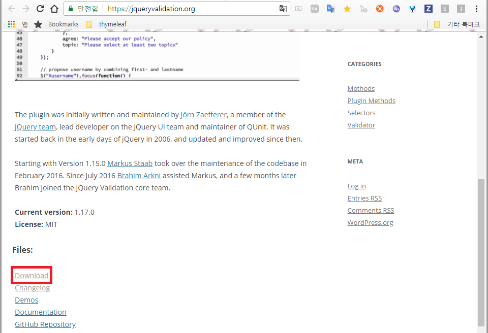
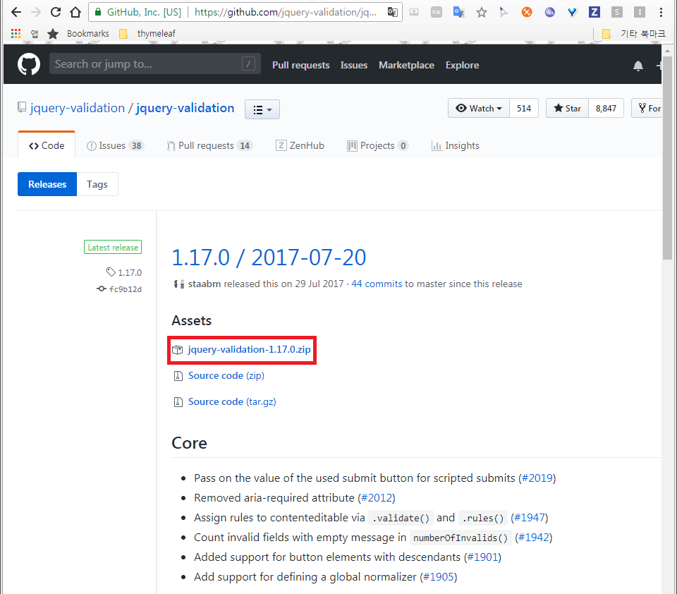

# 플러그인을 이용한 Validation 검사

### 1. 플러그인 다운로드

* **jquery validation plugin [공식 홈페이지](https://jqueryvalidation.org)로 이동 후 중간에 Download 클릭**

  

  

* **플러그인 다운로드**

  

  

* **압축 해제 후 다음 경로에 있는 js 파일을 복사하여 프로젝트로 이동**

  * 압축 해제한 jquery-validation-1.17.0폴더 안에 있는 dist 폴더로 이동
  * additional-methods.js(또는 additional-methods.min.js)와 jquery.validate.js(또는 jquery.validate.min.js)를 복사하여 프로젝트로 이동

### 2. 샘플 예제

* **프로젝트 폴더 구조**

  ```
  sample폴더
   ┗ html폴더
  	┗ sample.html
   ┗ js폴더
  	┗ sample.js
  	┗ jquery.validate.min.js
  	┗ additional-methods.min.js
  ```

* **sample.html**

  ```html
  <!DOCTYPE html>
  <html lang="en">
  <head>
      <meta charset="UTF-8">
      <meta name="viewport" content="width=device-width, initial-scale=1.0">
      <meta http-equiv="X-UA-Compatible" content="ie=edge">
      <title>Document</title>
      
  </head>
  <body>
      <form id="frm">
          <input type="text" name="id" id="id" placeholder="아이디"/><br/>
          <input type="password" name="password" id="password" placeholder="비밀번호"/><br/>
          <input type="password" name="repassword" id="repassword" placeholder="비밀번호 확인"/><br/>
          <input type="text" name="age" id="age" placeholder="나이"/><br/>
          <input type="text" name="name" id="name" placeholder="이름"/><br/>
          <input type="text" name="email" id="email" placeholder="이메일"/><br/>
          <input type="text" name="homepage" id="homepage" placeholder="홈페이지"/><br/>
          <input type="submit" value="회원가입" />
      </form>
      <script src="//code.jquery.com/jquery-3.3.1.js"></script>
      <script src="../js/jquery.validate.min.js"></script>
      <script src="../js/additional-methods.min.js"></script>
      <script src="../js/sample.js"></script>
  </body>
  </html>
  ```

* **sample.js**

  ```js
  $(function(){
      $("form").validate({
          rules: {
              id: {
                  required : true,
                  minlength : 4
              },
              password: {
                  required : true,
                  minlength : 8,
                  regex: /^(?=\w{8,20}$)\w*(\d[A-z]|[A-z]\d)\w*$/
              },
              repassword: {
                  required : true,
                  minlength : 8,
                  equalTo : password
              },
              name: {
                  required : true,
                  minlength : 2
              },
              age: {
                  digits : true
              },
              email: {
                  required : true,
                  minlength : 2,
                  email : true
              },
              homepage: {
                  url : true
              }
          },
          //규칙체크 실패시 출력될 메시지
          messages : {
              id: {
                  required : "필수로입력하세요",
                  minlength : "최소 {0}글자이상이어야 합니다"
              },
              password: {
                  required : "필수로입력하세요",
                  minlength : "최소 {0}글자이상이어야 합니다",
                  regex : "영문자, 숫자로 이루어져있으며 최소 하나이상 포함"
              },
              repassword: {
                  required : "필수로입력하세요",
                  minlength : "최소 {0}글자이상이어야 합니다",
                  equalTo : "비밀번호가 일치하지 않습니다."
              },
              name: {
                  required : "필수로입력하세요",
                  minlength : "최소 {0}글자이상이어야 합니다"
              },
              age: {
                  digits : "숫자만입력하세요"
              },
              email: {
                  required : "필수로입력하세요",
                  minlength : "최소 {0}글자이상이어야 합니다",
                  email : "메일규칙에 어긋납니다"
              },
              homepage: {
                  url : "정상적인 URL이 아닙니다"
              }
          }
      });
  })
  $.validator.addMethod(
      "regex",
      function(value, element, regexp) {
          var re = new RegExp(regexp);
          return this.optional(element) || re.test(value);
      },
      "Please check your input."
  );
  
  ```

  

